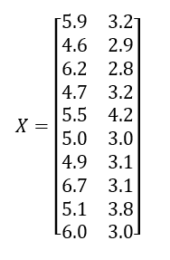

# ML LAB 11-11-2021

### Question 3
Given the matrix X whose rows represent different data points, 
Run k-means clustering on this dataset using the Euclidean distance as the distance function. 
Here k is chosen as 3. 
The centres of 3 clusters were initialized as μ1 = (6.2, 3.2) (red), μ2 = (6.6, 3.7) (green), μ3 = (6.5, 3.0) (blue). 

